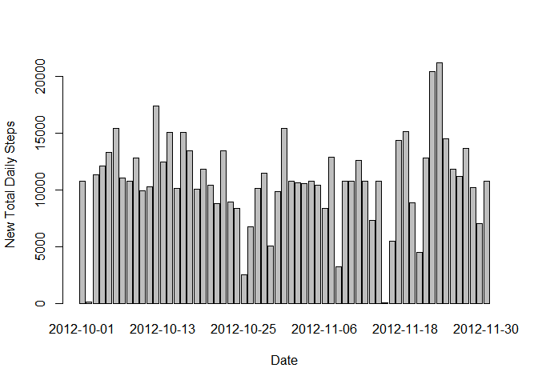

RepData Activity Monitoring
Reproducable Research - Peer Assignmet 1
Anahita Saghafi - 12/07/2014

# Reproducible Research: Peer Assessment 1


## Loading and preprocessing the data

Download the data from the follwoing location:

https://github.com/rdpeng/RepData_PeerAssessment1, unzip and save into your worrking directory as activity.csv.


```r
        setwd("C:\\Users\\anahitas\\RepData_PeerAssessment1")
        activity <- read.table("./activity.csv", sep=",", header=TRUE)
        head(activity)
```

```
##   steps       date interval
## 1    NA 2012-10-01        0
## 2    NA 2012-10-01        5
## 3    NA 2012-10-01       10
## 4    NA 2012-10-01       15
## 5    NA 2012-10-01       20
## 6    NA 2012-10-01       25
```

## What is mean total number of steps taken per day?

### 1.Make a histogram of the total number of steps taken each day


```r
totalDailySteps <- aggregate(steps~date,data=activity,FUN=sum)
barplot(totalDailySteps$steps,names.arg=totalDailySteps$date,xlab ="Date",ylab="Total Daily Steps")
```

 

### 2.Calculate and report the mean and median total number of steps taken per day


```r
m1 <-mean(totalDailySteps$steps)
m1
```

```
## [1] 10766
```

```r
m2 <-median(totalDailySteps$steps)
m2 
```

```
## [1] 10765
```

## What is the average daily activity pattern?

### 1.Make a time series plot (i.e. type = "l") of the 5-minute interval (x-axis) and the average number of steps taken, averaged across all days (y-axis)


```r
averageIntervalSteps <- aggregate(steps~interval,data=activity,FUN=mean)
plot(averageIntervalSteps,type="l")
```

 

### 2.Which 5-minute interval, on average across all the days in the dataset, contains the maximum number of steps?

```r
averageIntervalSteps$interval[which.max(averageIntervalSteps$steps)]
```

```
## [1] 835
```

## Imputing missing values

###  1.Calculate and report the total number of missing values in the dataset (i.e. the total number of rows with NAs)


```r
sum(is.na(activity))
```

```
## [1] 2304
```

### 2.Devise a strategy for filling in all of the missing values in the dataset. The strategy does not need to be sophisticated. For example, you could use the mean/median for that day, or the mean for that 5-minute interval, etc. 

The strategy for imputing missing values is to use mean for the corresponding 5-minute interval.


```r
averageIntervalStepsNew <- aggregate(steps~interval,data=activity,FUN=mean,na.rm= TRUE,na.action=NULL)
names(averageIntervalStepsNew)[1] <- "interval"
names(averageIntervalStepsNew)[2] <- "meanSteps"
head(averageIntervalStepsNew)
```

```
##   interval meanSteps
## 1        0   1.71698
## 2        5   0.33962
## 3       10   0.13208
## 4       15   0.15094
## 5       20   0.07547
## 6       25   2.09434
```

```r
activityMerge <- merge(activity, averageIntervalStepsNew,by ="interval",sort =FALSE)  
activityMerge <- activityMerge[with(activityMerge,order(date,interval)),] 
head(activityMerge)
```

```
##     interval steps       date meanSteps
## 1          0    NA 2012-10-01   1.71698
## 63         5    NA 2012-10-01   0.33962
## 128       10    NA 2012-10-01   0.13208
## 205       15    NA 2012-10-01   0.15094
## 264       20    NA 2012-10-01   0.07547
## 327       25    NA 2012-10-01   2.09434
```

```r
head(activityMerge)
```

```
##     interval steps       date meanSteps
## 1          0    NA 2012-10-01   1.71698
## 63         5    NA 2012-10-01   0.33962
## 128       10    NA 2012-10-01   0.13208
## 205       15    NA 2012-10-01   0.15094
## 264       20    NA 2012-10-01   0.07547
## 327       25    NA 2012-10-01   2.09434
```

```r
activityMerge$steps[is.na(activityMerge$steps)] <- activityMerge$meanSteps[is.na(activityMerge$steps)]
head(activityMerge)
```

```
##     interval   steps       date meanSteps
## 1          0 1.71698 2012-10-01   1.71698
## 63         5 0.33962 2012-10-01   0.33962
## 128       10 0.13208 2012-10-01   0.13208
## 205       15 0.15094 2012-10-01   0.15094
## 264       20 0.07547 2012-10-01   0.07547
## 327       25 2.09434 2012-10-01   2.09434
```

### 3.Create a new dataset that is equal to the original dataset but with the missing data filled in.


```r
activityNew <- activityMerge[,c(2,3,1)]
 
head(activityNew)
```

```
##       steps       date interval
## 1   1.71698 2012-10-01        0
## 63  0.33962 2012-10-01        5
## 128 0.13208 2012-10-01       10
## 205 0.15094 2012-10-01       15
## 264 0.07547 2012-10-01       20
## 327 2.09434 2012-10-01       25
```

```r
tail(activityNew)
```

```
##        steps       date interval
## 17242 2.6038 2012-11-30     2330
## 17305 4.6981 2012-11-30     2335
## 17364 3.3019 2012-11-30     2340
## 17441 0.6415 2012-11-30     2345
## 17506 0.2264 2012-11-30     2350
## 17568 1.0755 2012-11-30     2355
```

### 3. Make a histogram of the total number of steps taken each day and Calculate and report the mean and median total number of steps taken per day. Do these values differ from the estimates from the first part of the assignment? What is the impact of imputing missing data on the estimates of the total daily number of steps?

As we see below the impact is only on median. The mean is the same.


```r
totalDailyStepsNew <- aggregate(steps~date,data=activityNew,FUN=sum)
head(totalDailyStepsNew)
```

```
##         date steps
## 1 2012-10-01 10766
## 2 2012-10-02   126
## 3 2012-10-03 11352
## 4 2012-10-04 12116
## 5 2012-10-05 13294
## 6 2012-10-06 15420
```

```r
barplot(totalDailyStepsNew$steps,names.arg=totalDailyStepsNew$date,xlab ="Date",ylab="New Total Daily Steps")
```

 

```r
m1 <-mean(totalDailyStepsNew$steps)
m1
```

```
## [1] 10766
```

```r
m2 <-median(totalDailyStepsNew$steps)
m2 
```

```
## [1] 10766
```


## Are there differences in activity patterns between weekdays and weekends?


### 1. Create a new factor variable in the dataset with two levels -- "weekday" and "weekend" indicating whether a given date is a weekday or weekend day.


```r
weekLabel <- function(date) {
    if(weekdays(as.Date(date)) %in% c("Saturday","Sunday")){
        "weekend"
    } else{
        "weekday"    }
}
activityNew$weekLabel <- as.factor(sapply(activityNew$date,weekLabel))
head(activityNew)
```

```
##       steps       date interval weekLabel
## 1   1.71698 2012-10-01        0   weekday
## 63  0.33962 2012-10-01        5   weekday
## 128 0.13208 2012-10-01       10   weekday
## 205 0.15094 2012-10-01       15   weekday
## 264 0.07547 2012-10-01       20   weekday
## 327 2.09434 2012-10-01       25   weekday
```

### 2. Make a panel plot containing a time series plot (i.e. type = "l") of the 5-minute interval (x-axis) and the average number of steps taken, averaged across all weekday days or weekend days (y-axis).  


```r
par(mfrow = c(2, 1))
for (label in c("weekend", "weekday")) {
    activityLabel <- aggregate(steps~interval,data =activityNew,subset=activityNew$weekLabel==label,FUN=mean)
    plot(activityLabel, type="l", main=label)

}
```

 

 
